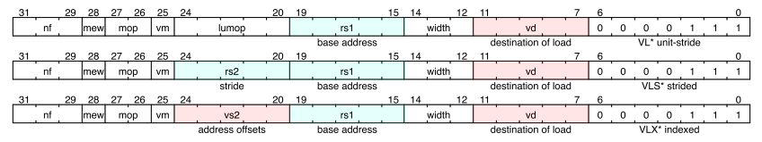
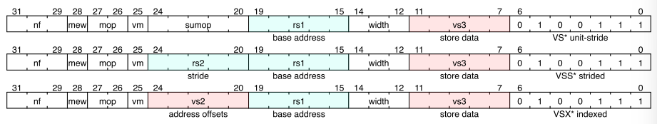

# 7. 向量访存指令

向量加载和存储指令在向量寄存器和内存之间的移动值。 向量加载和存储可用掩码，且不会在非活动元素上引发异常。 带掩码的向量加载指令不会更新目标向量寄存器组中被屏蔽的非活动元素，除非指定了屏蔽不可知（masked agnostic），即vtype.vma=1。带掩码的向量存储指令仅更新活动的内存元素。 所有向量加载和存储指令都可以生成并接受一个非零的 vstart 值。 

## 7.1 向量加载/存储指令编码

向量加载和存储指令编码在标量浮点加载和存储指令的主操作码 (LOAD-FP/STORE-FP) 中。 向量加载和存储指令编码重新利用了标准标量浮点加载/存储指令的12 位立即数字段的一部分，来提供进一步的向量指令编码，其中第 25 位保存标准向量掩码位（**请参阅掩码编码**）。 

主操作码 LOAD-FP 下的向量加载指令格式



主操作码 STORE-FP 下的向量存储指令格式




| 字段                  | 描述                                         |
| --------------------- | -------------------------------------------- |
| rs1[4:0]              | 保存基地址的x寄存器                          |
| rs2[4:0]              | 保存步长的x寄存器                            |
| vs2[4:0]              | 保存地址偏移的v寄存器                        |
| vs3[4:0]              | 保存待存储数据的v寄存器                      |
| vd[4:0]               | 加载目的v寄存器                              |
| vm                    | 指明向量掩码是否启用(0=启用，1=禁用)         |
| width[2:0]            | 指明内存元素的尺寸，并且与FP标量区分         |
| mew                   | 拓展的内存元素位宽，详见向量加载存储位宽编码 |
| mop[1:0]              | 指明内存地址的模式                           |
| nf[2:0]               | 指明每个段的数量，段加载/存储时使用          |
| lumop[4:0]/sumop[4:0] | 是单位步长指令的附加字段编码变体             |
|                       |                                              |

向量内存单元步长和常量步长操作直接对指令中要静态传输的数据的 EEW 进行编码，以减少在混合宽度例程中访问内存时的 vtype 更改次数。 索引操作使用指令中的显式EEW编码来设置所使用索引的大小，并使用SEW/LMUL来指定数据宽度。 


## 7.2 向量加载/存储指令的寻址模式 Vector Load/Store Addressing Modes

向量扩展支持单位步长、步长和索引（分散/聚集）寻址模式。 向量加载/存储基址寄存器和步长都取自通用寄存器 x 寄存器。 

所有向量访问的有效基地址由 rs1 中命名的 x 寄存器的内容给出。

向量单位步长寻址从有效基地址开始访问连续存储在内存中的元素。

向量常量步长操作访问位于有效基址的第一个内存元素，然后访问位于由 rs2 指定的 x 寄存器中包含的字节偏移量给定的地址增量处的后续元素。

向量索引操作将指定vs2的向量偏移操作数的每个元素的内容添加到基有效地址，以给出每个元素的有效地址。 数据向量寄存器组有EEW=SEW，EMUL=LMUL，而偏移向量寄存器组在指令中有EEW编码，EMUL=(EEW/SEW)*LMUL。

向量地址偏移地址按字节编址。

> 索引操作还可用于访问对象向量中的字段，其中 vs2 向量保存指向对象基址的指针，而标量 x 寄存器保存每个对象中成员字段的偏移量。 支持这种情况就是为什么没有定义索引操作来按数据 EEW 缩放元素索引。

如果向量偏移元素比 XLEN 窄，则在添加到基有效地址之前将它们零扩展到 XLEN。 如果向量偏移元素比 XLEN 宽，则在地址计算中使用最低有效 XLEN 位。 如果偏移元素不支持 EEW，则实现可能会引发非法指令异常。 

> 配置可以对小于 ELEN 的最大支持索引 EEW（例如，仅高达 XLEN）设置上限。 

向量寻址模式使用 2 位 mop[1:0] 字段进行编码 


<p align="middle">表 9 加载指令的mop[1:0] 字段编码</p>
| mop[1:0] | 描述     | 操作码        |
| -------- | -------- | ------------- |
| 00       | 单位步长 | VLE\<EEW\>    |
| 01       | 乱序索引 | VLUXEI\<EEW\> |
| 10       | 常量步长 | VLSE\<EEW\>   |
| 11       | 顺序索引 | VLOXEI\<EEW\> |

<p align="middle">表 10 存储指令的mop[1:0] 字段编码</p>
| mop[1:0] | 描述     | 操作码        |
| -------- | -------- | ------------- |
| 00       | 单位步长 | VLE\<EEW\>    |
| 01       | 乱序索引 | VLUXEI\<EEW\> |
| 10       | 常量步长 | VLSE\<EEW\>   |
| 11       | 顺序索引 | VLOXEI\<EEW\> |


向量单位步长和常量步长内存访问不保证单个元素访问之间的顺序。 向量索引加载和存储指令的内存操作有两种形式，有序和无序。 索引排序在内存访问时保留元素排序。 

对于无序指令 (mop!=11)，无法保证元素访问顺序。 如果是对强有序 IO 区域的访问，则元素访问可以以任何顺序启动。 

> 为了提供对强有序 IO 区域的有序向量访问，应该使用有序索引指令。 （mop=11）

对于具有精确向量trap的实现，索引无序存储的异常也必须是精确的。 额外的单位步长向量寻址模式分别使用单位步长加载和存储指令编码中的 5 位 lumop 和 sumop 字段进行编码。


<p align="middle"> 表11 lumop 字段编码</p>
| lumop[4:0] | 描述                        |
| ---------- | --------------------------- |
| 00000      | 单位步长，单向量寄存器加载  |
| 01000      | 单位步长，全向量寄存器加载  |
| 01011      | 单位步长，带mask加载，EEW=8 |
| 10000      | 单位步长，fault-only-first  |
| xxxxx      | 保留编码                    |


<p align="middle"> 表12 lumop 字段编码</p>
| lumop[4:0] | 描述                        |
| ---------- | --------------------------- |
| 00000      | 单位步长，单向量寄存器存储  |
| 01000      | 单位步长，全向量寄存器存储  |
| 01011      | 单位步长，带mask加载，EEW=8 |
| xxxxx      | 保留编码                    |


nf[2:0] 字段编码每个段中的字段数。 对于常规向量加载和存储指令，nf=0，表示在每个元素位置的向量寄存器组和内存之间移动单个值。 nf 字段中的较大值用于访问段内的多个连续字段，如下面的**向量加载/存储段指令部分**所述。 

段加载/存储的 nf 字段取代了地址偏移字段的相同位的使用。偏移量可以用单个标量整数计算替换，而段加载/存储添加了更强大的原语以将项目移入和移出内存。 

nf[2:0] 字段还对整个向量寄存器的数量进行编码，以便为整个向量寄存器加载/存储指令传输。


##  7.3 向量加载/存储的位宽编码 Vector Load/Store Width Encoding

向量加载和存储在指令中直接编码了 EEW。 相应的 EMUL 计算为 EMUL = (EEW/SEW)*LMUL。 如果 EMUL 超出范围（EMUL>8 或 EMUL<1/8），则保留指令编码。 向量寄存器组必须具有所选 EMUL 的合法寄存器说明符； 否则，指令编码被认为是保留的。 

向量单位步长和常量步长使用指令中编码的 EEW/EMUL 来处理数据值，而向量索引加载和存储使用指令中编码的 EEW/EMUL 来处理索引值，而使用 vtype 编码的 SEW/LMUL 来表示 数据值。 

矢量加载和存储使用标准标量浮点加载和存储未声明的宽度值进行编码。 

mew 位 (inst[28]) 预计将用于对 128 位及以上的扩展内存大小进行编码，但目前这些编码是保留的。 

必须在实现中提供所有支持的 SEW 设置的 EEW 的矢量加载和存储。 保留用于不受支持的 EEW 宽度的矢量加载/存储编码。 


<p align="middle"> 表13 向量加载和存储指令的位宽编码</p>
| 含义           | mew  | width[2:0] | Mem bits | Data reg bits | Index bits | opcode            | 备注                        |
| -------------- | ---- | ---------- | -------- | ------------- | ---------- | ----------------- | --------------------------- |
| 标准标量FP     | x    | 001        | 16       | FLEN          | -          | FLH/FSH           | 单位步长，单向量寄存器存储  |
| 标准标量FP     | x    | 010        | 32       | FLEN          | -          | FLW/FSW           | 单位步长，全向量寄存器存储  |
| 标准标量FP     | x    | 011        | 64       | FLEN          | -          | FLD/FSD           | 单位步长，带mask加载，EEW=8 |
| 标准标量FP     | x    | 100        | 128      | FLEN          | -          | FLQ/FSQ           | 保留编码                    |
| 8位向量元素    | 0    | 000        | 8        | 8             | -          | VLxE8/VSxE8       |                             |
| 16位向量元素   | 0    | 101        | 16       | 16            | -          | VLxE16/VSxE16     |                             |
| 32位向量元素   | 0    | 000        | 32       | 32            | -          | VLxE32/VSxE32     |                             |
| 64位向量元素   | 0    | 111        | 64       | 64            | -          | VLxE64/VSxE64     |                             |
| 128位向量元素  | 1    | 000        | 128      | 128           | -          | VLxE128/VSxE128   |                             |
| 256位向量元素  | 1    | 101        | 256      | 256           | -          | VLxE256/VSxE256   |                             |
| 512位向量元素  | 1    | 110        | 512      | 512           | -          | VLxE512/VSxE512   |                             |
| 1024位向量元素 | 1    | 111        | 1024     | 1024          | -          | VLxE1024/VSxE1024 |                             |
| 8位向量索引    | 0    | 000        | SEW      | SEW           | 8          | VLxEI8/VSxEI8     |                             |
| 16位向量索引   | 0    | 101        | SEW      | SEW           | 16         | VLxEI16/VSxEI16   |                             |
| 32位向量索引   | 0    | 110        | SEW      | SEW           | 32         | VLxEI32/VSxEI32   |                             |
| 64位向量索引   | 0    | 111        | SEW      | SEW           | 64         | VLxEI64/VSxEI64   |                             |

Mem bits 是在内存中访问的每个元素的大小。

Data reg bits 是寄存器中访问的每个数据元素的大小。 

Index bits 是在寄存器中访问的每个索引的大小。 

当前保留大于 64b 的数据和索引位 EEW 编码。 

RV128 将需要 128 的数据和索引 EEW。 


## 7.4  向量单步长访存指令

```assembly
# 向量单步长加载和存储指令举例

# vd是目标向量寄存器, rs1是访存的基址, vm是mask编码 (v0.t or <missing>)
vle8.v 	vd, (rs1), vm #  8-bit 单步长加载
vle16.v vd, (rs1), vm # 16-bit 单步长加载 
vle32.v vd, (rs1), vm # 32-bit 单步长加载 
vle64.v vd, (rs1), vm # 64-bit 单步长加载

# vle128.v  vd, (rs1), vm #  128-bit 单步长加载，保留
# vle256.v  vd, (rs1), vm #  256-bit 单步长加载，保留
# vle512.v  vd, (rs1), vm #  512-bit 单步长加载，保留
# vle1024.v vd, (rs1), vm # 1024-bit 单步长加载，保留

# vs3中是待存储的数据, rs1是访存基址, vm是mask编码 (v0.t or <missing>)
vse8.v  vs3, (rs1), vm #  8-bit 单步长存储
vse16.v vs3, (rs1), vm # 16-bit 单步长存储
vse32.v vs3, (rs1), vm # 32-bit 单步长存储
vse64.v vs3, (rs1), vm # 64-bit 单步长存储

# vse128.v  vs3, (rs1), vm #  128-bit 单步长存储，保留
# vse256.v  vs3, (rs1), vm #  256-bit 单步长存储，保留
# vse512.v  vs3, (rs1), vm #  512-bit 单步长存储，保留
# vse1024.v vs3, (rs1), vm # 1024-bit 单步长存储，保留

```

有另外的单步长加载和存储指令，来支持将掩码值传入/传出内存。 这些操作与无掩码字节加载或存储 (EEW=8) 指令相同，除了有效向量长度为 evl=ceil(vl/8)（即 EMUL=1），并且目标寄存器始终使用tail-agnostic策略写入。 

```assembly
# 向量单步长带掩码加载指令举例
vlm.v vd, (rs1)  # Load byte vector of length ceil(vl/8)
# 向量单步长带掩码存储指令举例
vsm.v vs3, (rs1) # Store byte vector of length ceil(vl/8)
```

> 之前的汇编程序助记符 vle1.v 和 vse1.v 令人困惑，因为这些指令与其他元素加载/存储指令的长度处理方式不同。 为了避免软件流失，这些旧的汇编助记符被当做别名保留。 

>提供掩码加载和存储指令的主要目的是支持在机器内部重新排列数据以减少跨数据路径布线。 然而，这也提供了一种方便的机制来访问内存中的打包位向量作为掩码寄存器，并通过减少更改 vl 的需要来降低掩码溢出/填充的成本。 


## 7.5  向量跨步访存指令

```assembly
# 向量跨步加载和存储指令举例

# vd是目标向量寄存器, rs1是访存的基址, rs2是按字节步长，vm是mask编码
vlse8.v 	vd, (rs1), rs2, vm #  8-bit 跨步加载
vlse16.v vd, (rs1), rs2, vm # 16-bit 跨步加载 
vlse32.v vd, (rs1), rs2, vm # 32-bit 跨步加载 
vlse64.v vd, (rs1), rs2, vm # 64-bit 跨步加载
# vlse128.v  vd, (rs1), rs2, vm #  128-bit 跨步加载，保留
# vlse256.v  vd, (rs1), rs2, vm #  256-bit 跨步加载，保留
# vlse512.v  vd, (rs1), rs2, vm #  512-bit 跨步加载，保留
# vlse1024.v vd, (rs1), rs2, vm # 1024-bit 跨步加载，保留

# vs3中是待存储的数据, rs1是访存基址, rs2是按字节步长，vm是mask编码
vsse8.v  vs3, (rs1), rs2, vm #  8-bit 跨步加载
vsse16.v vs3, (rs1), rs2, vm # 16-bit 跨步加载
vsse32.v vs3, (rs1), rs2, vm # 32-bit 跨步加载
vsse64.v vs3, (rs1), rs2, vm # 64-bit 跨步加载
# vsse128.v  vs3, (rs1), rs2, vm #  128-bit 跨步加载，保留
# vsse256.v  vs3, (rs1), rs2, vm #  256-bit 跨步加载，保留
# vsse512.v  vs3, (rs1), rs2, vm #  512-bit 跨步加载，保留
# vsse1024.v vs3, (rs1), rs2, vm # 1024-bit 跨步加载，保留
```

支持负数与零步长。

跨步访存指令中的元素访问彼此之间是无序的。

 当 rs2=x0 时，则允许但不要求实现执行比活动元素数量更少的内存操作，并且可以跨同一静态指令的不同动态执行进行不同数量的内存操作。

> 如果意图是要求执行所有内存访问，则编译器必须注意，当步长为 0 时，不要将 x0 形式用于 rs2。

当 rs2!=x0 并且 x[rs2]=0 时，实现必须为每个活动元素执行一次内存访问（但这些访问是乱序的）。 

> 当需要对同一内存地址重复有序向量访问时，可以使用有序索引操作。 


## 7.6  向量索引访存指令


``` assembly
# 向量索引加载和存储指令举例

# 向量乱序加载指令
# vd是目标向量寄存器, rs1是访存的基址, vs2是索引，vm是mask编码
vluxei8.v  vd, (rs1), vs2, vm #  8-bit 索引乱序加载SEW数据
vluxei16.v vd, (rs1), vs2, vm # 16-bit 索引乱序加载SEW数据 
vluxei32.v vd, (rs1), vs2, vm # 32-bit 索引乱序加载SEW数据 
vluxei64.v vd, (rs1), vs2, vm # 64-bit 索引乱序加载SEW数据

# 向量顺序加载指令
# vd是目标向量寄存器, rs1是访存的基址, vs2是索引，vm是mask编码
vloxei8.v  vd, (rs1), vs2, vm #  8-bit 索引顺序加载SEW数据
vloxei16.v vd, (rs1), vs2, vm # 16-bit 索引顺序加载SEW数据 
vloxei32.v vd, (rs1), vs2, vm # 32-bit 索引顺序加载SEW数据 
vloxei64.v vd, (rs1), vs2, vm # 64-bit 索引顺序加载SEW数据

# 向量乱序存储指令
# vs3是待存储的数据, rs1是访存的基址, vs2是索引，vm是mask编码
vsuxei8.v  vd, (rs1), vs2, vm #  8-bit 索引乱序存储SEW数据
vsuxei16.v vd, (rs1), vs2, vm # 16-bit 索引乱序存储SEW数据 
vsuxei32.v vd, (rs1), vs2, vm # 32-bit 索引乱序存储SEW数据 
vsuxei64.v vd, (rs1), vs2, vm # 64-bit 索引乱序存储SEW数据

# 向量顺序存储指令
# vs3是待存储的数据, rs1是访存的基址, vs2是索引，vm是mask编码
vsoxei8.v  vd, (rs1), vs2, vm #  8-bit 索引顺序存储SEW数据
vsoxei16.v vd, (rs1), vs2, vm # 16-bit 索引顺序存储SEW数据 
vsoxei32.v vd, (rs1), vs2, vm # 32-bit 索引顺序存储SEW数据 
vsoxei64.v vd, (rs1), vs2, vm # 64-bit 索引顺序存储SEW数据
```

> 索引加载和存储的汇编语法使用 eix 而不是 ex 来指示静态编码的 EEW 是索引而不是数据。

> 索引操作助记符有“U”或“O”来区分无序和有序，而其他向量寻址模式没有字符。 虽然这可能不太一致，但这种方法最大限度地减少了对现有软件的干扰，因为 VSXEI 以前意味着“有序” - 并且可以在转换期间将操作码保留为别名，以帮助减少软件流失。 


## 7.7 单步长 Fault-Only-First 加载指令

unit-stride fault-only-first load 指令用于向量化循环与数据相关的退出条件（“while”循环）。 这些指令除了只会捕获在索引为0的元素上的同步异常引起的trap之外，作为常规加载执行。如果索引为0的元素引发异常，则不会修改 vl 并引发trap。 如果索引大于0的元素引发异常，则不采取相应的trap操作，而是将向量长度 vl 寄存器减少到可能引发异常的元素索引。

加载指令可以覆盖超过报告trap的元素索引的活动目标向量寄存器组元素。 类似地，仅Fault-Only-First加载指令可以更新超过导致向量长度裁剪的元素（但不超过原始向量长度）的目标元素。 这些虚假更新的值不必与寻址存储器位置的存储器中的值相对应。 只有当知道相应的元素加载操作不会由于陷阱或向量长度修剪而重新启动时，才能访问非幂等内存位置。 

```assembly
# 向量 unit-stride Fault-Only-First 加载指令举例

# vd是目标向量寄存器, rs1是访存的基址, vs2是索引，vm是mask编码
vle8ff.v  vd, (rs1), vm #  8-bit unit-stride fault-only-first 加载指令
vle16ff.v vd, (rs1), vm # 16-bit unit-stride fault-only-first 加载指令
vle32ff.v vd, (rs1), vm # 32-bit unit-stride fault-only-first 加载指令
vle64ff.v vd, (rs1), vm # 64-bit unit-stride fault-only-first 加载指令
# vle128ff.v  vd, (rs1), vm #  128-bit unit-stride fault-only-first 加载指令，保留 
# vle256ff.v  vd, (rs1), vm #  256-bit unit-stride fault-only-first 加载指令，保留 
# vle512ff.v  vd, (rs1), vm #  512-bit unit-stride fault-only-first 加载指令，保留 
# vle1024ff.v vd, (rs1), vm # 1024-bit unit-stride fault-only-first 加载指令，保留

# 使用单步长 fault-only-first指令实现strlen函数的例子

# size_t strlen(const char *str) 
# a0 保存 *str 
strlen:
	mv a3, a0 			# 复制输入指针
loop:
	vsetvli a1, x0, e8, m8, ta, ma # 向量的最大长度字节数
	vle8ff.v v8, (a3)	# 向量加载多个字节
	csrr a1, vl			# 获取读到的字节数
	vmseq.vi v0, v8, 0 	# 当v8[i]==0时，设置v0[i]
	vfirst.m a2, v0 	# 寻找第一个置位的bit索引
	add a3, a3, a1 		# 移动指针
	bltz a2, loop		# 不是非零值，没找到？
	
	add a0, a0, a1 		# start + 最后一次读取长度
	add a3, a3, a2 		# start + 全部读取长度 + '\0'在最后一次读取中的索引
	sub a0, a3, a0		# 求得string length
	
	ret 
```

> Fault-Only-First 指令存在安全问题，因为该指令可用于探测可获取的有效地址。由于缺乏编码空间，没有提供跨步的 scatter/gather-only-first 指令，这些指令也可能存在更大的安全漏洞。漏洞会允许软件轻松检查多个随机页面的可访问性，而不会遇到trap。单步长版本的只允许探测与已知区域直接相邻的区域，因此不会明显影响安全性。在未来的拓展中，可以实施安全缓解措施，来允许非连续访问的 Fault-Only-First 变形指令。 

即使未引发异常，也允许CPU的实现处理少于 vl 的元素并相应地减少 vl，但如果 vstart=0 且 vl>0，则必须至少处理一个元素。 

当 Fault-Only-First 指令因中断trap时，实现不应减少 vl 而是应设置 vstart 值。 

> 译注：不理解这里遭遇中断的处理逻辑，设置vstart的值为多少？

当 Fault-Only-First 指令将在不是第一个元素上触发debug数据观察点trap时，实现不应减少 vl 而是应触发调试trap，否则事件可能会丢失。 


## 7.8 向量分段访存指令

这个指令子集被命名为指令集Zvlsseg。

向量分段访存指令将内存中的多个连续字段移入和移出连续编号的向量寄存器。 

这些操作通过将“结构体数组”类型（array-of-structures）中的每个字段解包到单独的向量寄存器中来支持对“结构体数组”数据类型的操作。 

向量指令编码中的nf[2:0]是一个无符号整数，比每段的字段数少1，字段数用NFIELDS表示，则NFIELDS=nf[2:0]+1。

EMUL的设定必须满足EMUL\*NFIELDS ≤ 8，否则该指令编码时保留的。

> 乘积 EMUL \* NFIELDS 表示被向量分段访存指令使用的底层向量寄存器的数量。 此约束使该总数不大于架构寄存器堆的 1/4，并且与 EMUL=8 的常规操作相同。 

每个字段将保存在连续编号的向量寄存器组中。 当 EMUL>1 时，每个域会占用一个向量寄存器组，保存在多个连续编号的向量寄存器中，每个字段的向量寄存器组必须遵循通常的向量寄存器对齐约束（例如，当 EMUL=2 和 NFIELDS=4 时，每个字段的向量寄存器组必须从偶数向量寄存器开始，但不必从 8 向量寄存器编号的倍数开始）。 

如果向量分段访存指令访问的向量寄存器编号将增加超过 31，则指令编码被保留。 

> 此约束有助于允许与具有更多可寻址向量寄存器的更长指令编码的前向兼容性。 

vl 寄存器给出要移动的结构体数，它等于传送到每个向量寄存器组的元素数。 mask也适用于整个结构体的层次。 

对于向量分段访存指令，用于访问每个段内的字段的各个内存访问彼此之间是无序的，即使对于顺序索引的向量分段访存指令也是如此。 

> 译注：这里的“访问每个段内的字段的各个内存访问”指的是对结构体类型内部的各个字段之间的访问，顺序索引仅约束相同的字段之间的内存访问。

如果发生trap，则 vstart 的设置以结构体为单位。 如果在访问结构的中途发生trap，则是否执行结构访问的子集由实现定义。 


### 7.8.1 向量单步长分段访存指令

向量单步长分段访存指令将打包的连续段（“结构体数组”）移动到多个目标向量寄存器组中。 

> 对于具有异构大小字段的结构，软件可以在分段加载指令将数据带入向量寄存器后使用附加指令从结构体中解包结构字段。

汇编前缀 vlseg/vsseg 分别用于单步长分段加载和存储指令。

```assembly
# 指令格式
vlseg<nf>e<eew>.v vd, (rs1), vm 	# 单步长分段加载指令的通用形式
vsseg<nf>e<eew>.v vs3, (rs1), vm	# 单步长分段存储指令的通用形式
# 举例
vlseg8e8.v vd, (rs1), vm # 将8个字段加载到8个向量寄存器
vsseg3e32.v vs3, (rs1), vm # 将分组的三个32bit向量段从vs3,vs3+1,vs3+2写入内存

```

对于加载指令，vd 寄存器将保存分段加载的第一个字段。 对于存储指令，vs3 寄存器将保存分段存储的第一个字段。 

``` assembly
# 例1
# 内存结构体存有装进结构体的RGB像素（24位结构）
vsetvli a1, t0, e8, ta, ma
vlseg3e8.v v8, (a0), vm
# v8存有红像素
# v9存有绿像素
# v10存有蓝像素

# 例2
# 内存结构体存有装进结构体的复数，实部虚部各32位
vsetvli a1, t0, e32, ta, ma 
vlseg2e32.v v8, (a0), vm 
# v8存有实部
# v9存有虚部
```

同样，也有单步长分段加载的fault-only-first指令。

```assembly
# 向量fault-only-first单步长分段加载指令的格式
vlseg<nf>e<eew>ff.v vd, (rs1), vm
```

对于Fault-only-first的分段加载指令，如果在访问段的中途检测到异常，无论元素索引是否为零，由CPU的实现决定是否装载已从内存加载的分段的子集。

这些指令可以在报告trap的或在vl被修改的时间点之后覆盖目标向量寄存器组元素。


### 7.8.2 向量跨步分段访存指令

向量跨步段加载和存储移动连续段，其中每个段由 rs2 通用寄存器参数中给出的字节步长偏移量分隔。 

> 支持负数和零步长

```assembly
# 指令格式
vlsseg<nf>e<eew>.v vd,  (rs1), rs2, vm 	# 跨步分段加载指令的通用形式
vssseg<nf>e<eew>.v vs3, (rs1), rs2, vm	# 跨步分段存储指令的通用形式
# 例1
vsetvli a1, t0, e8, ta, ma
vlsseg3e8.v v4, (x5), x6 	
# 将内存地址为x5+i*x6  的字节读进v4[i]
# 将内存地址为x5+i*x6+1的字节读进v5[i]
# 将内存地址为x5+i*x6+2的字节读进v6[i]

# 例2
vsetvli a1, t0, e32, ta, ma
vssseg2e32.v v2, (x5), x6 
# 将v2[i]中的32为数写入内存地址为x5+i*x6  的单元
# 将v3[i]中的32为数写入内存地址为x5+i*x6+4的单元
```

可以以任何顺序发生访问每个段内的字段，包括字节跨度使得段在内存中重叠的情况。 


### 7.8.3 向量索引分段访存指令

向量索引段分段访存指令移动连续段，其中每个分段的地址是x[rs1]+ v[vs2]。有顺序和乱序两种形式，其中顺序形式按元素顺序访问段。 然而，即使对于顺序形式，对单个段内的不同字段的访问也不是顺序的。 

向量寄存器组EEW=SEW，EMUL=LMUL，而索引向量寄存器组EEW在指令中编码为EMUL=(EEW/SEW)*LMUL。 

```assembly
# 指令格式
vluxseg<nf>ei<eew>.v  vd, (rs1), vs2, vm	# 乱序索引分段加载指令形式
vloxseg<nf>ei<eew>.v  vd, (rs1), vs2, vm 	# 顺序索引分段加载指令形式
vsuxseg<nf>ei<eew>.v vs3, (rs1), vs2, vm	# 乱序索引分段存储指令形式
vsoxseg<nf>ei<eew>.v vs3, (rs1), vs2, vm	# 顺序索引分段存储指令形式

# 例1
vsetvli a1, t0, e8, ta, ma
vluxseg3ei32.v v4, (x5), v3
# 将内存地址为x5+i*v3[i]  的字节读进v4[i]
# 将内存地址为x5+i*v3[i]+1的字节读进v5[i]
# 将内存地址为x5+i*v3[i]+2的字节读进v6[i]

# 例2
vsetvli a1, t0, e32, ta, ma
vsuxseg2ei32.v v2, (x5), v5
# 将v2[i]中的32为数写入内存地址为x5+v5[i]  的单元
# 将v3[i]中的32为数写入内存地址为x5+v5[i]+4的单元
```

对于向量索引分段加载指令，目标向量寄存器组不能与源向量寄存器组（由 vs2 指定）重叠，否则指令编码是保留的。 

> 此约束支持在加载结构体期间引发异常时，重新启动索引分段加载。

## 7.9 向量寄存器组访存指令

在 LOAD-FP 主操作码下的向量寄存器组加载指令的格式

 

这些指令加载和存储整个向量寄存器组。

> 这些指令旨在用于在向量寄存器当前内容的类型或长度未知时保存和恢复向量寄存器，或者用在修改 vl 和 vtype 的成本很高时。示例包括编译器寄存器溢出、在向量寄存器中传递值的向量函数调用、中断处理程序和操作系统上下文切换。 软件可以通过读取 vlenb 寄存器来确定传输的字节数。

加载指令有一个 EEW 编码在 mew 和 width 字段中，遵循常规单步长加载的模式。

> 由于寄存器字节布局与内存字节布局相同，因此无论 EEW 是什么，都会将相同的数据写入目标寄存器组。 因此，仅提供 EEW=8 变体指令就足够了。向量拓展提供了完整的 EEW 变体指令，以便编码的 EEW 可用作提示，指示接下来将使用此 EEW 访问目标寄存器组，这有助于CPU实现在内部重新排列数据。

向量寄存器组存储指令的编码类似于 EEW=8 的unmasked单步长存储指令。 

nf 字段编码了要加载和存储的向量寄存器的数量。 编码的寄存器数量必须是 2 的幂，并且向量寄存器编号必须像向量寄存器组一样对齐，否则指令编码是保留的。 nf 字段编码在基数之后连续编号。 仅支持 1、2、4、8 的 nf 值，保留其他值。 当传输多个寄存器时，最低编号的向量寄存器保存在最低编号的内存地址中，连续的向量寄存器编号在内存中连续放置。 

无论 vtype 和 vl 中的当前设置如何，向量寄存器组访存指令都以有效向量长度 evl=nf*VLEN/EEW 运行。 如果 vstart ≥ vl 则不写入任何元素这样的常用判定不适用于这些指令。 相反，如果 vstart ≥ evl，则不写入任何元素。 

这些指令的操作类似于unmasked单步长访存指令，x[rs1]保存基地址。

> 如果基地址不是自然对齐的以字节为单位的编码 EEW 的大小 (EEW/8) 或CPU实现支持的最小 SEW（以字节为单位），则允许CPU实现在寄存器组加载和存储时引发未对齐的地址异常（ $\rm{SEW_{MIN}/8}$）。 


```assembly
# 指令格式
vl1r.v 		v3, (a0)	# 伪代码，等价于vl1re8.v v3, (a0)
vl1re8.v 	v3, (a0)	# 将a0寄存器中地址指向的VLEN/8 个 8bit数加载进v3寄存器
vl1re16.v 	v3, (a0) 	# 将a0寄存器中地址指向的VLEN/16个16bit数加载进v3寄存器
vl1re32.v 	v3, (a0) 	# 将a0寄存器中地址指向的VLEN/32个32bit数加载进v3寄存器
vl1re64.v 	v3, (a0)	# 将a0寄存器中地址指向的VLEN/64个16bit数加载进v3寄存器

vl2r.v 		v2, (a0)	# 伪代码，等价于vl2re8.v v2, (a0)
vl2re8.v 	v2, (a0)	# 将a0寄存器中地址指向的2*VLEN/8 个 8bit数加载进v2-v3寄存器
vl2re16.v 	v2, (a0) 	# 将a0寄存器中地址指向的2*VLEN/16个16bit数加载进v2-v3寄存器
vl2re32.v 	v2, (a0) 	# 将a0寄存器中地址指向的2*VLEN/32个32bit数加载进v2-v3寄存器
vl2re64.v 	v2, (a0)	# 将a0寄存器中地址指向的2*VLEN/64个16bit数加载进v2-v3寄存器

vl4r.v 		v4, (a0)	# 伪代码，等价于vl4re8.v v4, (a0)
vl4re8.v 	v4, (a0)	# 将a0寄存器中地址指向的4*VLEN/8 个 8bit数加载进v4-v7寄存器
vl4re16.v 	v4, (a0) 	# 将a0寄存器中地址指向的4*VLEN/16个16bit数加载进v4-v7寄存器
vl4re32.v 	v4, (a0) 	# 将a0寄存器中地址指向的4*VLEN/32个32bit数加载进v4-v7寄存器
vl4re64.v 	v4, (a0)	# 将a0寄存器中地址指向的4*VLEN/64个16bit数加载进v4-v7寄存器

vl8r.v 		v8, (a0)	# 伪代码，等价于vl8re8.v v8, (a0)
vl8re8.v 	v8, (a0)	# 将a0寄存器中地址指向的8*VLEN/8 个 8bit数加载进v8-v15寄存器
vl8re16.v 	v8, (a0) 	# 将a0寄存器中地址指向的8*VLEN/16个16bit数加载进v8-v15寄存器
vl8re32.v 	v8, (a0) 	# 将a0寄存器中地址指向的8*VLEN/32个32bit数加载进v8-v15寄存器
vl8re64.v 	v8, (a0)	# 将a0寄存器中地址指向的8*VLEN/64个16bit数加载进v8-v15寄存器

vs1r.v v3, (a1) 		# 将v3寄存器的值存储到x[a1]中地址
vs2r.v v2, (a1)			# 将v2-v3寄存器的值存储到x[a1]中地址
vs4r.v v4, (a1)			# 将v4-v7寄存器的值存储到x[a1]中地址
vs8r.v v8, (a1)			# 将v8-v15寄存器的值存储到x[a1]中地址

```

> 对于不受支持的 EEW 值，实现应在 vl<nf>r 指令上引发非法指令异常。 

> 我们已经考虑添加一个完整的寄存器掩码加载指令 (vl1re1.v vd, (rs1)) 作为掩码提示，但这目前不在 PoR 上。 


 


